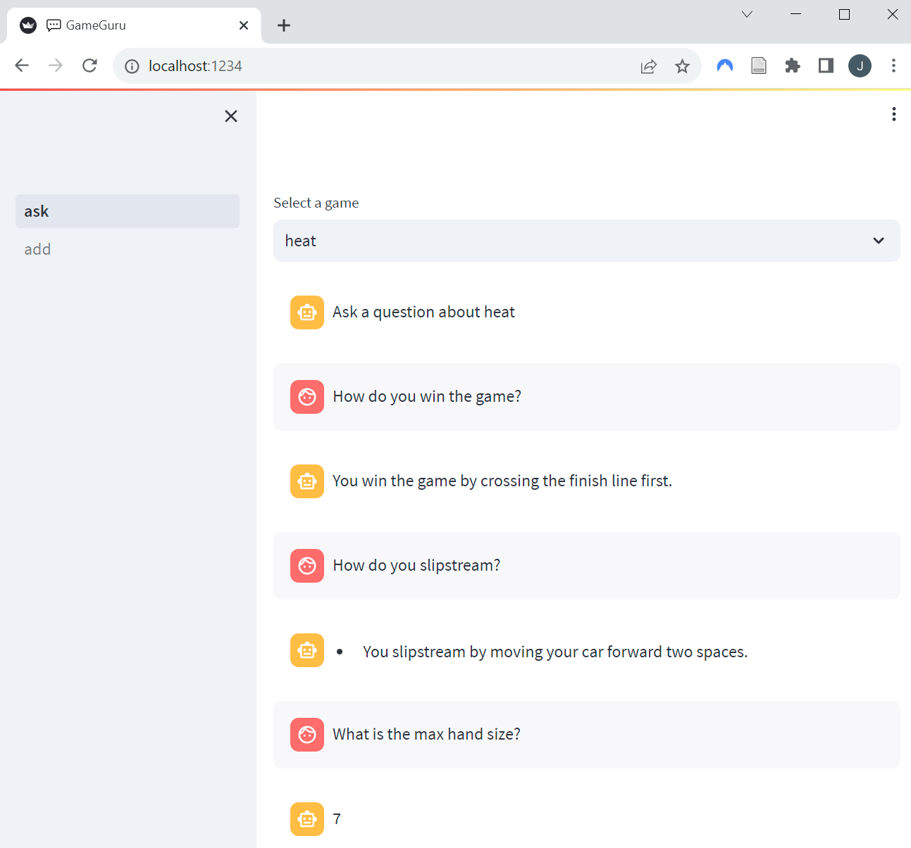

# GameGuru
Demo LLM application that allows you to ask questions about board game rules.



# Setup

1. Clone the repository
```
git clone https://github.com/Jessevdz/gameguru.git
```

2. Download your preferred LLAMA 2 weights from [their official repository](https://github.com/facebookresearch/llama).

3. Copy the LLAMA 2 model weights and tokenizer into the llama_model/ folder. The folder should contain the following:
```
├── llama_model/
│   ├── checklist.chk
│   ├── consolidated.00.pth
│   ├── params.json
│   ├── tokenizer.model
│   ├── ...
```

4. Build and run the containers
```
docker compose up
```

4. Browse to http://localhost:1234 to interact with the front-end.